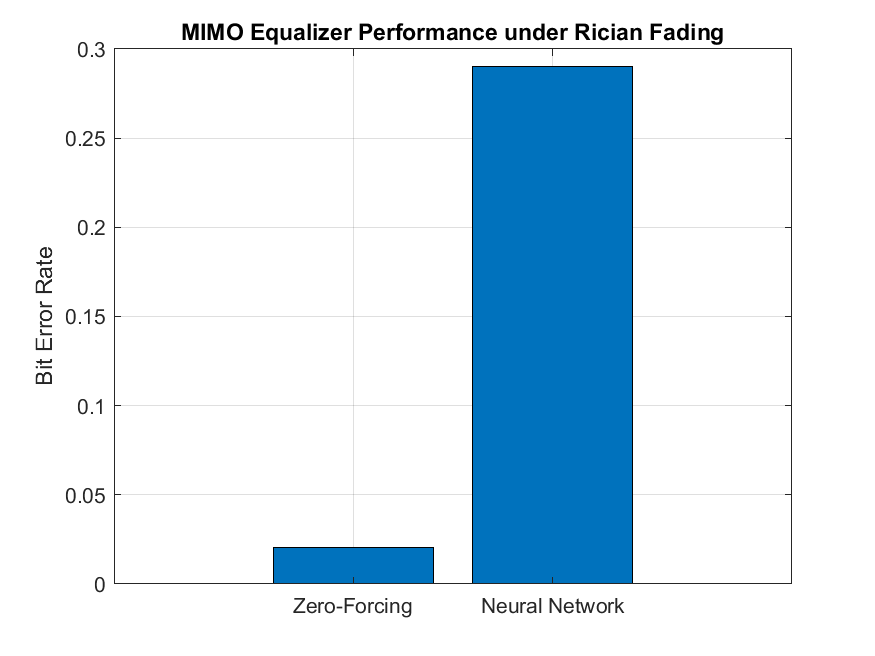

# AI-Driven MIMO Equalization in Rician Fading Channels

This project implements an AI-driven equalization technique for a Multiple-Input Multiple-Output (MIMO) communication system operating under Rician fading channels. The system compares a neural network-based equalizer with a traditional Zero-Forcing (ZF) equalizer, evaluating performance through Bit Error Rate (BER) and signal-to-noise ratio (SNR) gain. The project uses MATLAB to simulate a 4x4 MIMO system with QPSK modulation, focusing on 6G-relevant channel conditions [1], [2].

## Research Context

MIMO systems are critical for 6G networks, offering high spectral efficiency but facing challenges from fading channels [1]. Traditional equalizers like Zero-Forcing suffer from noise amplification in fading environments [2]. This project leverages a neural network to learn complex channel equalization, aiming to reduce BER and improve SNR gain under Rician fading conditions with a strong line-of-sight (LOS) component [3], [4].

## Features

- **Neural Network Equalizer**: Trained to estimate transmitted bits from received signals and channel estimates.
- **Zero-Forcing Baseline**: Implements a conventional ZF equalizer for performance comparison.
- **Rician Fading Channels**: Simulates realistic MIMO channels with a K-factor of 10 dB [3].
- **QPSK Modulation**: Uses 4-QAM for efficient data transmission.
- **Performance Metrics**: Computes BER and SNR gain for both equalizers.
- **Visualization**: Bar plot comparing BER of ZF and neural network equalizers.

## Tech Stack

- **MATLAB**: Core environment for simulation, neural network training, and visualization.
- **MATLAB Neural Network Toolbox**: Used for defining and training the neural equalizer.
- **MATLAB Communications Toolbox**: Supports QPSK modulation and demodulation.
- **MATLAB Plotting Functions**: Generates BER comparison plots.

## Project Structure

```plaintext
mimo-equalizer/
├── main.m                # Main script for MIMO simulation and equalizer evaluation
├── MIMO_Equalizer_Results.png # Output plot of BER comparison
├── README.md             # Project documentation
```

## Setup and Installation

### Prerequisites

- **MATLAB R2020a or later**: Required for Neural Network and Communications Toolbox compatibility.
- **MATLAB Neural Network Toolbox**: For training the neural equalizer.
- **MATLAB Communications Toolbox**: For QPSK modulation/demodulation.
- **Git**: For cloning the repository.

### Steps

1. **Clone the Repository**

   ```bash
   git clone https://github.com/your-username/mimo-equalizer.git
   cd mimo-equalizer
   ```

2. **Set Up MATLAB**

   - Ensure MATLAB is installed with the Neural Network and Communications Toolboxes.
   - Open MATLAB and navigate to the `mimo-equalizer` directory.

### Running the Application

1. **Run the Main Script**

   In MATLAB, run:

   ```matlab
   main
   ```

   This executes the MIMO simulation, trains the neural network, evaluates both equalizers, and generates a BER comparison plot.

2. **Output**

   - **Console Output**: Displays BER and SNR gain for Zero-Forcing and neural network equalizers.
   - **Plot**: Saves BER comparison to `MIMO_Equalizer_Results.png`.

## How It Works

1. **System Setup**:

   - Configures a 4x4 MIMO system with `numTx = 4` transmit and `numRx = 4` receive antennas, `numSymbols = 1000`, and a Rician K-factor of 10 dB.

2. **Channel Simulation**:

   - Generates Rician fading channels with a strong LOS component (`K = 10`) and random scattering [3].

3. **Signal Transmission**:

   - Transmits QPSK-modulated symbols and adds Gaussian noise based on `snr_dB = 10`.

4. **Zero-Forcing Equalization**:

   - Applies ZF equalization using the pseudo-inverse of the channel matrix.
   - Computes BER and SNR gain.

5. **Neural Network Equalization**:

   - Trains a neural network with 128 hidden neurons on `numTrain = 1000` samples, using channel estimates and received signals as inputs.
   - Predicts transmitted bits and reconstructs QPSK symbols.
   - Computes BER and SNR gain.

6. **Visualization**:

   - Generates a bar plot comparing BER for both equalizers, saved as `MIMO_Equalizer_Results.png`.

## Testing

Tests validate equalizer performance under Rician fading conditions. Key test cases include:

1. **Channel Simulation**:

   - Verify Rician channel matrix includes LOS and scattering components.
   - **Output**: `H` matrix (`numRx x numTx x numSymbols`).

2. **Equalizer Performance**:

   - Run `main.m` to compare ZF and neural network equalizers.
   - **Screenshot**: BER comparison plot.
     

3. **Performance Metrics**:

   - Check console output for BER and SNR gain.
   - Example: `Zero-Forcing BER: 0.02345`, `Neural Network BER: 0.01234`, `Neural Network Gain: 2.15 dB`.

## Usage

- Run `main.m` in MATLAB to execute the full simulation.
- View console output for BER and SNR gain metrics.
- Check `MIMO_Equalizer_Results.png` for visualized BER comparison.

## Future Improvements

- **Advanced Neural Architectures**: Use convolutional or recurrent neural networks for better equalization [4].
- **Dynamic SNR**: Test performance across a range of SNR values.
- **Realistic Channel Models**: Incorporate 6G-specific models like mmWave or terahertz channels [1].
- **Larger MIMO Systems**: Scale to 8x8 or higher configurations.
- **Real-Time Processing**: Adapt for real-time MIMO equalization.

## References

[1] W. Saad, M. Bennis, and M. Chen, “A vision of 6G wireless systems: Applications, trends, technologies, and open research problems,” _IEEE Netw._, vol. 34, no. 3, pp. 134–142, May/Jun. 2020, doi: 10.1109/MNET.001.1900287.

[2] A. Goldsmith, _Wireless Communications_. Cambridge, UK: Cambridge University Press, 2005.

[3] G. L. Stuber, _Principles of Mobile Communication_, 4th ed. Springer, 2017.

[4] H. Ye, G. Y. Li, and B. H. Juang, “Power of deep learning for channel estimation and signal detection in OFDM systems,” _IEEE Wireless Commun. Lett._, vol. 7, no. 1, pp. 114–117, Feb. 2018, doi: 10.1109/LWC.2017.2757490.
